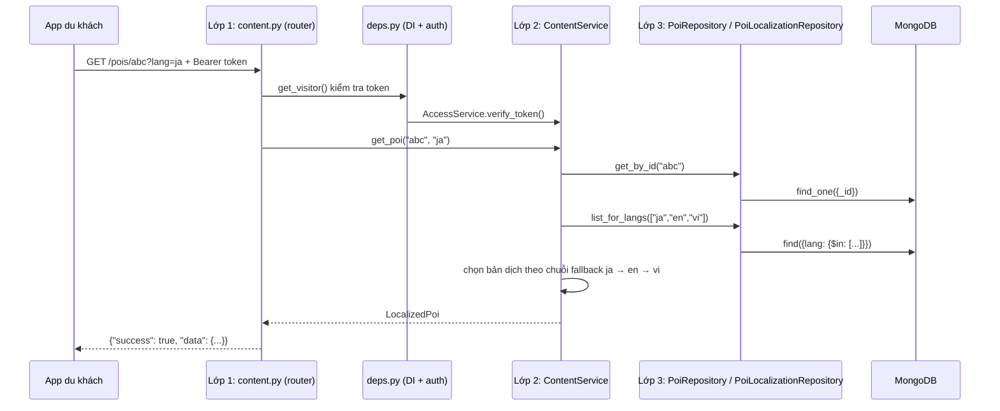

# 1. Kiến trúc 3 lớp

## 1.1 Khái niệm

**Kiến trúc 3 lớp (3-layer / n-tier)** chia code backend theo *trách nhiệm*:

| Lớp | Thư mục | Được làm | KHÔNG được làm |
|---|---|---|---|
| **1. Presentation** | `app/api/` | Nhận HTTP request, validate dữ liệu (Pydantic), kiểm tra đăng nhập/quyền, gọi Service, trả JSON | Viết `if` nghiệp vụ, gọi Repository hay MongoDB |
| **2. Business Logic** | `app/services/` | Toàn bộ quy tắc nghiệp vụ, điều phối nhiều Repository | Biết tới HTTP (status code, Request), viết câu truy vấn Mongo |
| **3. Data Access** | `app/repositories/`, `app/integrations/` | Đọc/ghi MongoDB, gọi dịch vụ ngoài (Google Translate, Edge-TTS, OpenRouter, cổng thanh toán), lưu file | Chứa quy tắc nghiệp vụ |

Luồng gọi **một chiều**: `api → services → repositories/integrations`. Không đi ngược, không nhảy cóc.

**Lợi ích:** đổi MongoDB sang PostgreSQL chỉ sửa lớp 3; đổi FastAPI sang framework khác chỉ sửa lớp 1; test được từng lớp riêng (API test bằng Service giả, Service test bằng DB giả).

## 1.2 Một request đi qua 3 lớp như thế nào

Ví dụ: du khách mở chi tiết POI bằng tiếng Nhật — `GET /api/v1/pois/{id}?lang=ja`



Nếu POI không tồn tại: Repository trả `None` → Service ném `NotFoundError` → `app/api/errors.py` đổi thành **HTTP 404** `{"success": false, "error": {"code": "POI_NOT_FOUND", ...}}`.

## 1.3 Dependency Injection (`app/api/deps.py`)

Mỗi request FastAPI tự "lắp ráp": `Database → Repository → Service` qua các hàm `get_xxx_service`, rồi đưa vào endpoint bằng `Depends(...)`. Nhờ vậy khi test lớp API chỉ cần:

```python
app.dependency_overrides[get_poi_service] = lambda: service_gia
```

## 1.4 Chuẩn hóa response & xử lý lỗi tập trung

- Thành công: `{"success": true, "data": ..., "message": null}`
- Lỗi: `{"success": false, "error": {"code": "...", "message": "...", "details": ...}}`

| Ngoại lệ (lớp 2) | HTTP |
|---|---|
| `NotFoundError` | 404 |
| `ConflictError`, `PaymentPendingError` | 409 |
| `BusinessRuleError` | 400 |
| `UnauthorizedError` | 401 |
| `ForbiddenError` | 403 |
| Pydantic validation | 422 (`VALIDATION_ERROR`, kèm danh sách trường sai) |
| `RateLimitError` | 429 |
| `ExternalServiceError` | 503 |

## 1.5 Các quyết định thiết kế đáng chú ý

| Vấn đề | Cách làm | Lý do |
|---|---|---|
| Lưu nội dung đa ngôn ngữ | Collection riêng `poi_localizations` (1 dòng / POI / ngôn ngữ) + `source_hash` | Thêm ngôn ngữ không phải sửa schema; sửa mô tả gốc thì bản dịch cũ tự hết hiệu lực |
| Không có bản dịch | Fallback 3 tầng: ngôn ngữ yêu cầu → tiếng Anh → tiếng Việt | Khách không bao giờ thấy màn hình trống |
| Dịch + TTS chậm | Chạy nền (`BackgroundTaskRunner`, tối đa 3 tác vụ song song) | Admin không phải chờ; không bị Google chặn vì gọi dồn |
| Audio trùng lặp | Tên file = MD5(nội dung + giọng) | Cùng nội dung không tạo lại audio |
| Tải dữ liệu (PRD Key Logic 1) | `GET /content/bundle` tải toàn bộ 1 lần + **ETag** | Lần mở sau dữ liệu không đổi → 304, gần như không tốn mạng |
| Chatbot RAG | BM25 tự viết (bỏ dấu tiếng Việt) + LLM tùy chọn | Miễn phí; không có API key vẫn trả lời kiểu trích đoạn |
| Thanh toán | Cổng giả lập ký **HMAC-SHA256** + webhook idempotent | Mô phỏng đúng luồng Payoo trong PRD mà không cần tài khoản merchant |
| Dịch vụ ngoài | Interface (Protocol) + bản giả trong test | Test chạy offline, nhanh, ổn định |
