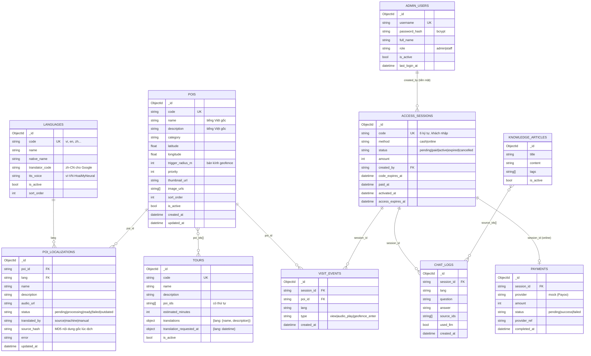

# 2. ERD — Thiết kế dữ liệu (MongoDB, 13 collection)

MongoDB không có khóa ngoại thật; quan hệ được thể hiện bằng trường `*_id` và được **lớp Service** đảm bảo (ví dụ: xóa POI thì Service xóa luôn bản dịch và gỡ POI khỏi các tour).

## Mô hình lưu nội dung đa ngôn ngữ

- Nội dung **gốc** (tiếng Việt) nằm trong `pois`. Admin chỉ nhập tiếng Việt.
- Mỗi ngôn ngữ là **1 document** trong `poi_localizations`, khóa duy nhất `(poi_id, lang)`.
- `source_hash = MD5(name + description gốc)`. Bản dịch chỉ **hợp lệ** khi `source_hash` khớp nội dung gốc hiện tại → sửa mô tả gốc thì mọi bản dịch cũ tự động không được dùng nữa, hệ thống dịch lại ở nền.
- `translated_by = manual`: admin sửa tay → dịch máy không ghi đè (trừ khi chọn "Dịch lại toàn bộ").

**Vì sao không nhúng `translations` vào `pois`?** 16 ngôn ngữ × (mô tả dài + trạng thái + lỗi) làm document POI phình to, mỗi lần cập nhật 1 ngôn ngữ phải ghi cả document, và khó truy vấn "các bản dịch đang lỗi". Tour thì ngắn (chỉ tên + mô tả 1 câu) nên nhúng `translations` cho đơn giản.

## Index

| Collection | Index | Mục đích |
|---|---|---|
| languages | `code` unique | |
| pois | `code` unique; `(is_active, sort_order)` | |
| poi_localizations | `(poi_id, lang)` unique | upsert, tra cứu nhanh |
| tours | `code` unique | |
| admin_users | `username` unique | |
| access_sessions | `code` unique; `(status, created_at)` | đổi mã, lọc lịch sử |
| payments | `session_id` | |
| chat_logs | `(session_id, created_at)` | giới hạn số câu/ngày |
| visit_events | `(poi_id, created_at)` | thống kê |
| ui_translations | `lang` unique | nhãn giao diện đã dịch |
| chat_cache | `key` unique; **TTL** trên `expires_at` | MongoDB tự xóa cache hết hạn |
| media_files | `key` unique | file audio (key = MD5 nội dung + giọng) |

## Collection phụ trợ (không phải thực thể nghiệp vụ)

| Collection | Nội dung | Ghi chú |
|---|---|---|
| `ui_translations` | `{lang, strings: {key: text}, source_hash}` | Dịch 1 lần / ngôn ngữ, dịch lại khi chuỗi gốc đổi |
| `chat_cache` | `{key, answer, expires_at}` | Cache câu trả lời chatbot, hết hạn sau `CHAT_CACHE_TTL_SECONDS` |
| `media_files` | `{key, data: Binary, content_type, size}` | File mp3 ~50–300 KB (< 16 MB/document); phục vụ qua `/media/...`, hỗ trợ tua (HTTP Range) |
