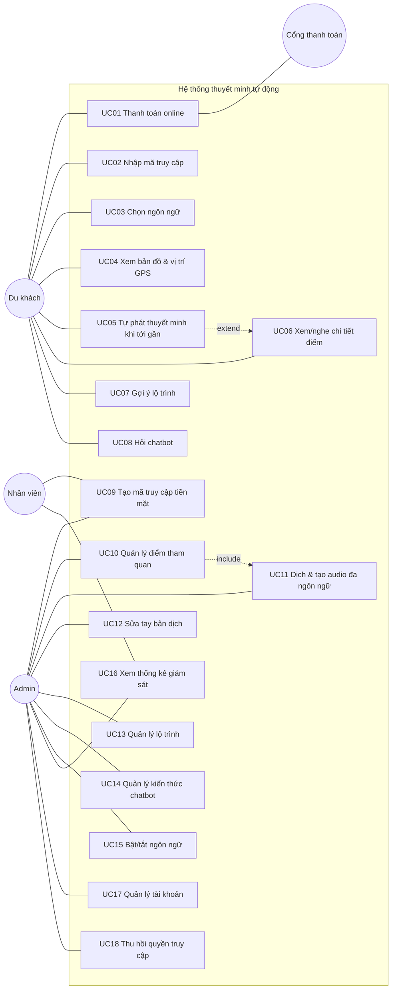

# 3. Use Case

## Tác nhân (Actor)

| Actor | Mô tả |
|---|---|
| **Du khách** | Người tham quan, dùng app trên điện thoại |
| **Nhân viên (staff)** | Bán vé tiền mặt tại quầy, xem dữ liệu |
| **Quản trị viên (admin)** | Quản lý nội dung, ngôn ngữ, tài khoản, giám sát |
| **Cổng thanh toán** | Hệ thống ngoài (Payoo — hiện dùng bản giả lập), gọi webhook |
| **Dịch vụ AI/dịch/TTS** | Google Translate, Edge-TTS, LLM (OpenRouter) |

## Sơ đồ

## Đặc tả các use case chính

### UC01 — Thanh toán online
- **Actor:** Du khách, Cổng thanh toán
- **Luồng chính:** (1) Khách bấm "Thanh toán online" → (2) hệ thống tạo phiên `pending` + giao dịch, trả URL cổng → (3) khách thanh toán → (4) cổng gọi **webhook có chữ ký HMAC** → hệ thống chuyển phiên sang `paid` → (5) cổng chuyển khách về app kèm mã → (6) app tự đổi mã lấy token (UC02).
- **Ngoại lệ:** chữ ký sai → từ chối 401; webhook gọi lặp → bỏ qua (idempotent); thanh toán thất bại → phiên `cancelled`; app đổi mã khi chưa nhận webhook → 409 `PAYMENT_PENDING`, app tự thử lại.
- **API:** `POST /access/online`, `POST /payments/webhook`, `POST /access/token`

### UC02 — Nhập mã truy cập
- **Tiền điều kiện:** có mã (từ UC01 hoặc nhân viên đưa — UC09)
- **Luồng chính:** khách nhập mã 6 ký tự (không phân biệt hoa/thường) → hệ thống kiểm tra → lần đầu thì kích hoạt (`active`, bắt đầu tính 24 giờ) → trả access token.
- **Ngoại lệ:** sai mã → 404; mã quá hạn chưa dùng → `expired`; mã bị thu hồi → lỗi. Đã kích hoạt mà còn hạn → cấp lại token (khách đổi máy/xóa cache).

### UC03 — Chọn ngôn ngữ
- **Luồng chính:** khách chọn ngôn ngữ ở ô chọn góc phải → nhãn giao diện đổi ngay (16 ngôn ngữ; ngoài vi/en được dịch máy lần đầu rồi lưu lại) → app tải lại dữ liệu theo ngôn ngữ mới.
- **Ngôn ngữ chưa có bản dịch:** hệ thống **tự xếp hàng dịch + tạo audio ở nền** cho các điểm còn thiếu (không cần admin), trong lúc chờ app hiển thị bản dự phòng (tiếng Anh → tiếng Việt) kèm thông báo "đang dịch", cứ 4 giây tải lại cho đến khi xong.
- **Ngoại lệ:** dịch lỗi (mất mạng) → giữ bản dự phòng, 5 phút sau khách chọn lại mới thử dịch lại.

### UC05 — Tự phát thuyết minh khi tới gần (geofence)
- **Luồng chính:** app theo dõi GPS → khi khoảng cách tới POI ≤ `trigger_radius_m` **liên tục ≥ 3 giây** (chống nhiễu GPS) → chọn POI ưu tiên cao nhất (rồi gần nhất) → mở chi tiết + phát audio đúng ngôn ngữ → ghi sự kiện `geofence_enter`.
- **Quy tắc:** cùng một POI chỉ tự phát lại sau 5 phút; đang phát audio thì không ngắt.
- **Ngoại lệ:** chưa có audio ngôn ngữ đó → dùng bản tiếng Anh/tiếng Việt hoặc giọng đọc của trình duyệt; khách có thể bấm "Tạo bản dịch & audio" (dịch ngay — `POST /pois/{id}/localizations/{lang}/ensure`).

### UC08 — Hỏi chatbot (AI tạo sinh)
- **Luồng chính:** khách hỏi bằng ngôn ngữ bất kỳ → hệ thống gửi cho AI (Gemini/Groq/OpenRouter): quy tắc phạm vi + **toàn bộ tài liệu của chùa** (nội dung các điểm + bài viết kiến thức; kho lớn thì chỉ gửi các đoạn liên quan nhất theo BM25) + **vài lượt hỏi-đáp trước** của phiên → AI trả lời tự nhiên bằng ngôn ngữ của khách, kèm nguồn tài liệu được nhắc tới.
- **Phạm vi:** trả lời mọi điều về Chùa Linh Ứng và chuyến tham quan (lịch sử, kiến trúc, Phật giáo liên quan, giờ mở cửa, đường đi, các điểm gần chùa...). Câu hỏi ngoài phạm vi (lập trình, chính trị, bài tập...) → từ chối lịch sự và gợi ý câu hỏi phù hợp, kể cả khi người dùng cố "bẻ" hướng dẫn.
- **Độ chính xác:** ưu tiên tài liệu của chùa; không bịa số liệu, ngày tháng, giá cả; không chắc thì nói rõ và gợi ý hỏi nhân viên.
- **Dự phòng:** chưa cấu hình AI hoặc AI lỗi/quá tải → trích câu liên quan nhất trong tài liệu (BM25) rồi dịch sang ngôn ngữ khách.
- **Quy tắc:** tối đa `CHAT_DAILY_LIMIT` câu/phiên/ngày (429); câu hỏi mở đầu giống nhau dùng cache (MongoDB); câu nối tiếp không dùng cache vì phụ thuộc ngữ cảnh.

### UC10 + UC11 — Quản lý điểm tham quan & dịch tự động
- **Actor:** Admin
- **Luồng chính:** admin nhập tên + nội dung tiếng Việt + chọn tọa độ trên bản đồ + bán kính → lưu → hệ thống **tự xếp hàng** dịch sang mọi ngôn ngữ đang bật và tạo audio ở nền → admin theo dõi bảng trạng thái từng ngôn ngữ.
- **Quy tắc:** mã POI duy nhất; đổi tên/nội dung → bản dịch cũ hết hiệu lực và dịch lại; chỉ đổi tọa độ → không dịch lại; xóa POI → xóa bản dịch, gỡ khỏi lộ trình.
- **Ngoại lệ:** dịch lỗi 1 ngôn ngữ không ảnh hưởng ngôn ngữ khác (trạng thái `failed` + lý do); TTS lỗi vẫn giữ bản dịch chữ.

### UC09 — Tạo mã truy cập tiền mặt
- **Actor:** Nhân viên/Admin. Nhân viên thu tiền → nhập số lượng (1–50) + ghi chú → hệ thống sinh mã (bỏ ký tự dễ nhầm 0/O, 1/I/L), trạng thái `paid`, hạn đổi 24 giờ.

## Ma trận phân quyền

| Chức năng | Du khách | Staff | Admin |
|---|:-:|:-:|:-:|
| Xem nội dung, chatbot, lộ trình | ✅ (có token) | ✅ xem thử | ✅ xem thử |
| Tạo mã tiền mặt | | ✅ | ✅ |
| Xem POI/tour/thống kê | | ✅ | ✅ |
| Thêm/sửa/xóa POI, tour, kiến thức, dịch | | | ✅ |
| Bật/tắt ngôn ngữ, quản lý tài khoản, thu hồi mã | | | ✅ |
