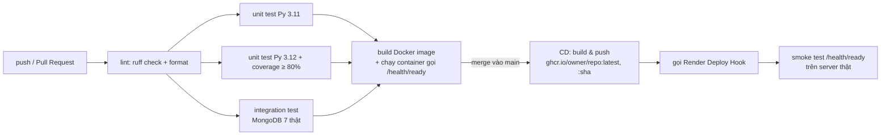

# 5. CI/CD & triển khai

## 5.1 Khái niệm

- **CI (Continuous Integration — tích hợp liên tục):** mỗi lần push/PR, máy chủ GitHub tự kiểm tra code (lint, test, build). Code lỗi bị phát hiện ngay, không lọt vào nhánh chính.
- **CD (Continuous Delivery/Deployment — triển khai liên tục):** code đã qua CI trên nhánh `main` được **tự động** đóng gói (Docker image) và đưa lên server.

## 5.2 Pipeline



| File | Kích hoạt | Job |
|---|---|---|
| `.github/workflows/ci.yml` | push/PR vào `main`, `develop` | `lint` → `test` (ma trận 3.11/3.12, chạy riêng test từng lớp) + `integration` → `docker` |
| `.github/workflows/cd.yml` | CI thành công trên `main` (hoặc bấm tay *Run workflow*) | `publish` (GHCR) → `deploy` (Render + smoke test) |

## 5.3 Cài đặt lần đầu (≈ 20 phút, miễn phí)

### Bước 1 — Đưa code lên GitHub
```bash
git init && git add . && git commit -m "feat: khởi tạo backend 3 lớp"
git branch -M main
git remote add origin https://github.com/<owner>/Multilingual-audio-guide-be.git
git push -u origin main
git checkout -b develop && git push -u origin develop
```
Vào tab **Actions** sẽ thấy workflow **CI** chạy.

### Bước 2 — Bảo vệ nhánh main
*Settings → Branches → Add branch ruleset* cho `main`: bật **Require a pull request before merging** (≥ 1 approval) và **Require status checks to pass** (chọn các job `Lint`, `Unit test`, `Integration test`, `Build Docker image`).

### Bước 3 — Tạo database MongoDB Atlas (free M0)
1. https://cloud.mongodb.com → tạo cluster **M0 Free**.
2. *Database Access* → tạo user/password. *Network Access* → thêm `0.0.0.0/0` (cho Render truy cập).
3. *Connect → Drivers* → copy chuỗi `mongodb+srv://...`.

### Bước 4 — Tạo Web Service trên Render
1. https://render.com → **New → Web Service** → kết nối repo GitHub → **Runtime: Docker**.
2. **Auto-Deploy: No** (để GitHub Actions quyết định khi nào deploy — chỉ sau khi CI xanh).
3. **Environment Variables:**

| Biến | Giá trị |
|---|---|
| `APP_ENV` | `production` |
| `MONGO_URI` | chuỗi Atlas ở bước 3 |
| `JWT_SECRET` | chuỗi ngẫu nhiên ≥ 32 ký tự |
| `FIRST_ADMIN_PASSWORD` | mật khẩu admin mạnh |
| `PAYMENT_WEBHOOK_SECRET` | chuỗi ngẫu nhiên |
| `PUBLIC_BASE_URL` | `https://<tên-app>.onrender.com` |
| `OPENROUTER_API_KEY` | (tùy chọn) bật chatbot LLM |

4. **Health Check Path:** `/health/ready`.
5. *Settings → Deploy Hook* → copy URL.

> Ở `APP_ENV=production`, server **từ chối khởi động** nếu còn dùng `JWT_SECRET`/mật khẩu admin/webhook secret mặc định (fail-fast, xem `Settings.validate_for_production`).

### Bước 5 — Khai báo secrets cho CD
Repo GitHub → *Settings → Secrets and variables → Actions → New repository secret*:
- `RENDER_DEPLOY_HOOK_URL` = URL ở bước 4.5
- `APP_URL` = `https://<tên-app>.onrender.com`

Từ giờ: **merge PR vào `main` → CI xanh → CD tự build image, đẩy lên GHCR, deploy Render và kiểm tra server sống.**

## 5.4 Lưu ý

- Render free "ngủ" sau 15 phút không dùng; lần gọi đầu mất ~1 phút để thức dậy (smoke test đã chờ tối đa 10 phút).
- File audio được lưu **ngay trong MongoDB** (collection `media_files`, mặc định `MEDIA_STORAGE=mongo`), nên deploy lại Render không mất audio. Gói Atlas M0 có 512 MB — đủ cho ~100 điểm × 16 ngôn ngữ.
- Image Docker có tag `latest` và tag theo commit SHA → muốn rollback chỉ cần deploy lại image cũ.
